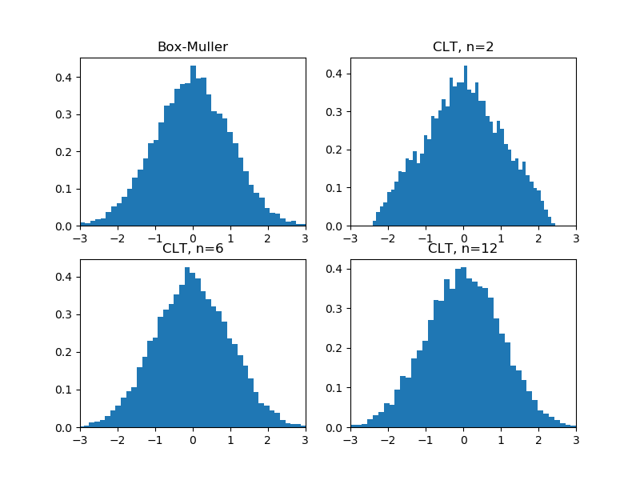
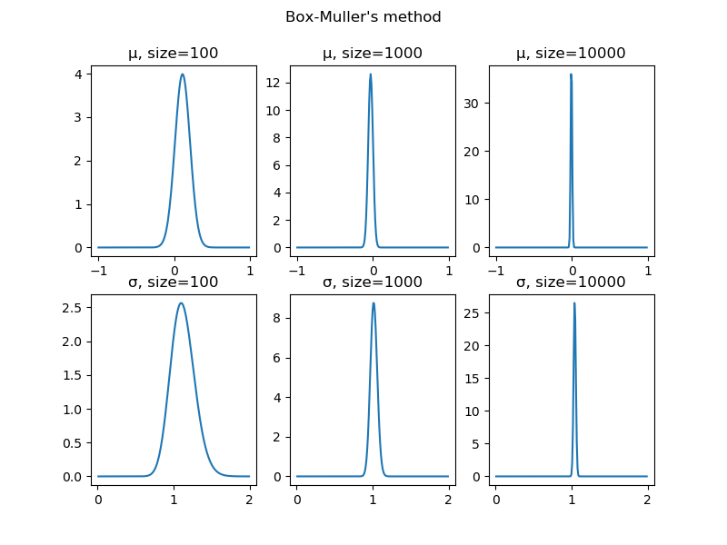
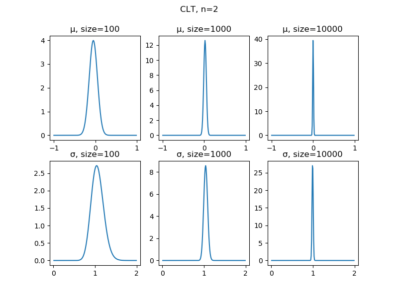

# 2020/3/14：確率分布乱数の品質を測りたかったはなし
オセロAIを作っている過程で確率分布サンプラーを実装する必要があり、さらに仕様上近似値としてしか実装できなかった。  
自作サンプラーの品質が気になり、乱数の品質ってどうやって測るんだろうと思ったのがきっかけ。  
結論を言えば私の試みは失敗したしきちんとした方法が割とメジャーでありました。

## サンプルから母数を区間推定すれば品質がわかる？
自分で考えてみた結果、サンプラーから得たサンプルから仮定している確率分布の母数を区間推定することで品質が測れるのではと思いつきました。ベイズ推定の事後分布を見て分散が大きければそれだけサンプラーの定まりが悪いってことだよねという理屈です。  
実験の対象は中心極限定理を利用した標準正規分布乱数とします。任意の確率分布乱数複数個の平均は正規分布に従うというあれです。一様乱数からのサンプル数を大きくする毎にどれくらい標準正規分布乱数に近似するようになるかを観察します。  
ちなみにボックス＝ミュラー法を使った乱数と一様乱数からのサンプル数を変化させた中心極限定理近似乱数10000サンプルそれぞれのヒストグラムが以下です。  
  
一様乱数2個からの近似はさすがに使い物にならなそうなのがわかります。三角形をしています。  
でベイズ推定ですが、正規分布母数である平均と分散はそれぞれ正規分布と逆ガンマ分布が自然共役です。この自然共役性を利用して事後分布を導出してます。

## たぶんいいやりかたではない
ボックス＝ミュラー法でサンプルした乱数と一様乱数2個から標準正規分布乱数を近似したものをそれぞれ推定した結果を比較してみます。前述の通り一様乱数2個での近似はすこぶる品質が悪いはずで、事後分布の収束もまた相対的に悪いはずです。サンプル数を100、1000、10000の場合でそれぞれ推定しました。    

まずボックス＝ミュラー法からのサンプルを推定した事後分布  
  

続いて一様乱数2個による中心極限定理近似からのサンプルを推定した事後分布
  

あれ、そんなに変わらないような…。  
思うに、母数を区間推定するやりかたは品質の良い測りかたではないですね。今回試した標準正規分布乱数って、どんなに近似が遠くても「平均が0で分散が1の何か」なんですよね。それを「正規分布を仮定した」推定をしてもそらあ結果は平均0で分散1なわけです。  
なんだかすっごい自明な気がしてきた…。

## ちゃんとしたやりかた
検索が下手だったようで確率分布乱数品質の正しい測りかたがしばらくわからずじまいだったのですが、統計検定2級の公式教科書を読んでいたら偶然正しい方法を知れました。正規分布だったら尖度、歪度を調べるとかQQプロットを見るとか、後は適合度検定をするとか色々とあるようです。  
確率分布乱数品質測定の知見がないわけないとは思っていましたが、思っていたより基本的な情報でした。  

[ブログトップに戻る](../)